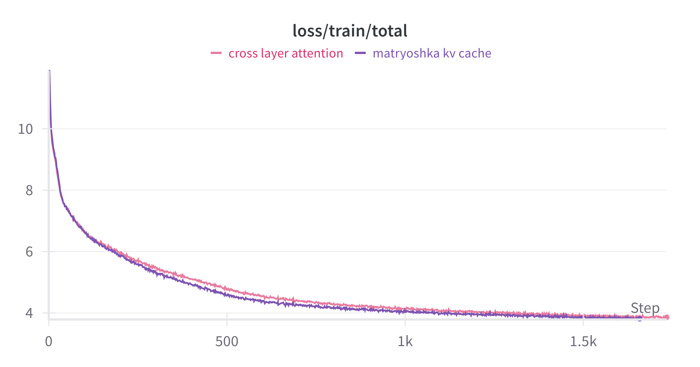

# matryoshka-kvcache
Matryoshka KV cache for reduced cache size in large language model


## Set up
The code uses training setup from MosaicML LLM Foundry, which can be found [here](https://github.com/mosaicml/llm-foundry/tree/main/scripts/train).

### Installation
```
# Creating and activate a virtual environment
python3 -m venv llmfoundry-venv
source llmfoundry-venv/bin/activate

pip install cmake packaging torch wheel  # setup.py requires these be installed

git clone https://github.com/mosaicml/llm-foundry.git
cd llm-foundry

pip install -e ".[gpu]"  # or `pip install -e .` if no NVIDIA GPU.
cd ..
```

Clone this repository outside of llm-foundry
```
git clone https://github.com/iankur/matryoshka-kvcache.git
cd matryoshka-kvcache
```

### Dataset preparation
```
python ../llm-foundry/scripts/data_prep/convert_dataset_hf.py --dataset allenai/c4 --data_subset en --out_root ./my-copy-c4 --splits train_small val_small --concat_tokens 2048 --tokenizer EleutherAI/gpt-neox-20b --eos_text '<|endoftext|>'
```

### Train
```
composer train.py yamls/mpt-125m.yaml train_loader.dataset.split=train_small eval_loader.dataset.split=val_small
```



### Acknowledgements
- [MosaicML LLM Foundry](https://github.com/mosaicml/llm-foundry)